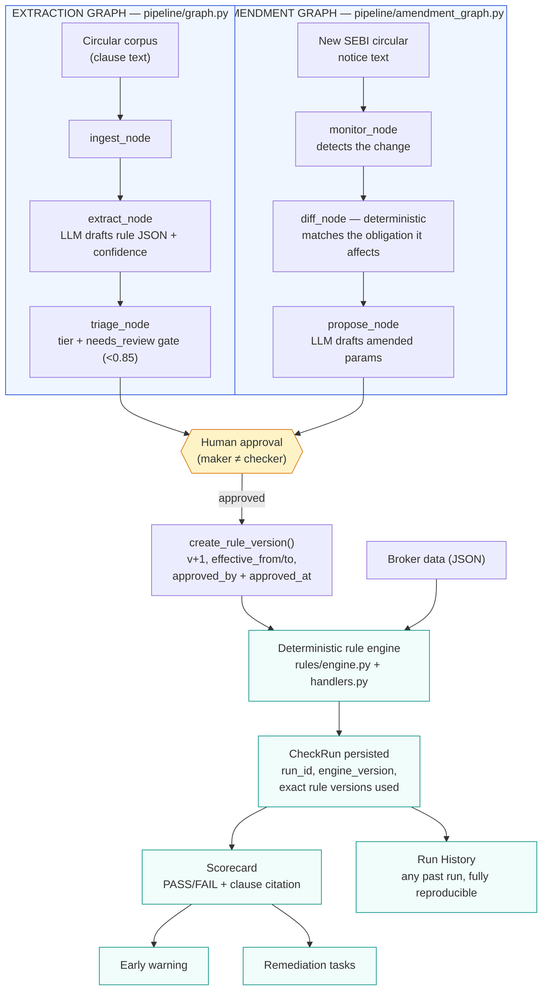

# RegCheck — Architecture

RegCheck turns SEBI's Master Circular for Stock Brokers into executable, auditable
compliance checks — and keeps them current when SEBI amends a rule, without a human
ever re-reading the new circular from scratch. This document explains the full
system: two LangGraph pipelines, the three-tier triage model, the deterministic rule
engine, the audit trail, and exactly which parts are LLM-driven vs. plain Python.

## The core design principle

**The LLM drafts. The engine decides.**

An LLM is excellent at reading unstructured regulatory prose and proposing a structured
interpretation — but it is non-deterministic and unauditable as a decision-maker. A
regulator or auditor needs the *same* answer every time, with a traceable reason. So
RegCheck draws a hard line everywhere an LLM appears, in both pipelines below:

- The LLM only ever **drafts** — a new rule, or an amended parameter. Output is always
  reviewed by a human before it can run.
- PASS/FAIL, coverage, warnings, remediation, and every persisted audit record are
  **plain deterministic Python**. No LLM call happens anywhere near a verdict.

## Two LangGraph pipelines

RegCheck runs two separate, small LangGraph graphs — one that turns a clause into a
rule the first time, and one that closes the loop when SEBI *changes* a rule that
already exists. This second graph is what makes "agentic compliance" a literal claim
rather than "an LLM call behind a button": it watches for a regulatory change, works
out which existing obligation it affects, and drafts the fix, before a human ever has
to re-read the new circular themselves.

**Legend:** blue = LLM/LangGraph involved. Amber = human-in-the-loop gate. Teal = pure
deterministic Python, no LLM, ever.

## Stage-by-stage

| Stage | Module(s) | LLM? | Output |
|---|---|---|---|
| Ingest | `pipeline/ingest.py` | No | Clause text + title loaded from the corpus |
| Extract | `pipeline/extract.py`, `llm/provider_router.py` | **Yes** (Groq fast / OpenRouter strong) | Structured rule JSON + confidence score |
| Triage | `pipeline/triage.py` | No | Tier assignment + `needs_review` gate at confidence < 0.85 |
| Monitor | `pipeline/monitor.py` | No | Detects a new circular notice needs processing |
| Diff / impact | `pipeline/diff.py` | No (deliberately) | Matches the notice to the existing obligation it amends, by clause reference |
| Propose | `pipeline/propose.py` | **Yes** | Drafted amended parameters, with citation to the new circular |
| Human approval | `POST /api/rules/{id}/approve`, `POST /api/amendment/commit` | No | Maker ≠ checker; rule becomes `approved` and/or a new version is created |
| Rule engine | `rules/engine.py`, `rules/handlers.py` | No | `CheckResult` (PASS/FAIL/NOT_APPLICABLE) with evidence + clause citation |
| Audit persistence | `storage/store.py::save_check_run` | No | Immutable `CheckRun` — see **Audit trail** below |
| Report | `GET /api/report` | No | Live scorecard, every result clickable to its clause |
| Early warning | `warnings.py` | No | Obligations that PASS today but breach within 21 days |
| Remediation | `remediation.py` | No | FAIL → owner, fix, due date |

## LangGraph usage

**Extraction graph** (`pipeline/graph.py`): `ingest_node → extract_node → triage_node → END`.
Turns one clause into one structured rule, once.

**Amendment graph** (`pipeline/amendment_graph.py`): `monitor_node → diff_node → propose_node → END`.
Turns a new circular notice into a drafted amendment to an *existing* rule. The
`diff_node` is deliberately deterministic, not an LLM call — matching a paragraph
reference that's explicitly printed in the notice against the citations already on
our rules is a plain string match, not something that benefits from (or should risk)
an LLM's judgment. The LLM only re-enters at `propose_node`, drafting *what the new
parameter should be* — same discipline as extraction.

Both graphs are intentionally small and linear rather than heavily branched, because
the interesting complexity in RegCheck is the deterministic engine and the audit
trail behind it, not the graph topology. LangGraph earns its place here specifically
because it gives each pipeline a clean, typed, inspectable state object
(`PipelineState`, `AmendmentPipelineState`) that's straightforward to extend — e.g. a
retry-on-low-confidence branch, without restructuring anything downstream.

**`monitor_node`'s real input source.** The demo ships with a manually-supplied notice
text (the sample buttons on Circular Monitor), but `pipeline/sebi_fetch.py` is the real
version of the same seam: it polls SEBI's actual, live circulars listing page (verified
against SEBI's real site — the RSS feed at sebirss.xml turned out too sparse for
circulars specifically and was dropped in favor of the listing page), downloads and
extracts an unseen circular's real PDF text with pdfplumber, and feeds that straight
into `monitor_node` exactly like the manual samples do. `GET /api/agentic/sebi-feed` and
`POST /api/agentic/poll-sebi` expose this. A circular whose PDF can't be extracted (a
scanned image, no digital text) is marked seen with the failure reason recorded, rather
than silently retried forever or silently dropped.

## Provider routing (Groq + OpenRouter)

`backend/app/llm/provider_router.py` exposes one function, `call_llm(prompt, tier)`,
used by both `extract_node` and `propose_node`:

- `tier="fast"` → **Groq** (cheap, low-latency — used by default, since both
  extraction and amendment-drafting are iterate-and-review workflows where speed
  matters more than the strongest possible reasoning).
- `tier="strong"` → **OpenRouter** (routes to a stronger model — for a clause or
  amendment ambiguous enough to warrant it).
- `LLM_PROVIDER_MODE=groq|openrouter` in `.env` overrides the tier logic and forces
  everything through one provider (useful if you only have one key).

Both providers speak the OpenAI-compatible chat-completions schema, so the router is a
single `httpx` call shape with the base URL/key/model swapped. See
`backend/scripts/eval_extraction.py` for a real (not fabricated) precision/recall
measurement of the extraction stage against hand-labeled clauses — results in
`backend/data/eval_results.json`.

## The three triage tiers

1. **Auto-checkable** — the obligation reduces to a deterministic comparison against
   broker data (a date, a ratio, a periodicity). The engine runs it with zero human
   involvement per run (a human approved the rule once, at extraction/amendment time).
2. **Evidence-tracked** — the check itself is data-driven (e.g. "was the certificate
   filed within 60 days?"), but the *evidence* needs a human to confirm it's genuine
   (e.g. is this actually a valid CA-signed certificate, not a forged PDF?).
3. **Human judgment** — no data check is possible. The obligation is qualitative (e.g.
   "is the grievance redressal mechanism adequate?"). RegCheck surfaces these
   obligations explicitly rather than pretending to automate them — this is what makes
   the coverage % honest.

**Coverage % = auto-checkable obligations ÷ total obligations**, computed live from
whatever rules currently exist (`pipeline/triage.py::compute_coverage`), not hardcoded.

## Audit trail & rule versioning

SEBI's brief names *"maintaining audit trails"* as a core ongoing-compliance
challenge. RegCheck answers it structurally, not just with a report page:

- **Rules are versioned, never mutated.** `Rule.version`, `effective_from`,
  `effective_to`, and `supersedes` (see `storage/models.py`). Amending a rule — via
  the manual Amendment Simulator or the agentic amendment loop — calls
  `store.create_rule_version()`, which closes out the old version's `effective_to`,
  archives it to `rules.history.json`, and activates a new version in
  `rules.live.json`. A run persisted *before* an amendment stays judged against the
  rule version that was actually in force at the time — permanently.
- **Every scorecard run is an immutable `CheckRun`.** `run_id`, `run_at`,
  `engine_version`, and the full `CheckResult` list (including which `rule_version`
  produced each verdict) are persisted via `store.save_check_run()`. `GET /api/runs`
  and `GET /api/runs/{run_id}` (surfaced in the dashboard's Run History view) answer
  the question a live-recomputed report never could: *"what did we report on 31
  March, and prove it."*
- **Approval has provenance.** `approved_by` + `approved_at` on every rule, with a
  maker ≠ checker constraint — the person who drafts an extraction or amendment
  cannot be the same person who approves it, matching standard practice in Indian
  financial-services governance.

This is also the honest foundation for the Neo4j-backed obligation-supersession graph
described under **Storage** below — `supersedes` already encodes the edge; Neo4j would
only change how it's queried, not whether it exists.

## The agentic amendment loop, end to end

1. A new SEBI circular notice arrives (`POST /api/agentic/detect` — demo-triggered
   with a prepared notice; a production deployment would feed this from a scheduled
   poll of SEBI's circular index).
2. `diff_node` matches it, deterministically, to the existing obligation it amends.
3. `propose_node` has the LLM draft the new parameter value, citing the notice.
4. A human reviews the proposal and calls `POST /api/amendment/commit` to approve it.
5. `create_rule_version()` fires: the old rule version closes, a new one activates.
6. The full scorecard re-runs against the new version and is persisted as a fresh
   `CheckRun` — so the dashboard shows exactly which verdicts flipped, with the same
   clause citation, no manual re-reading of the circular required anywhere in the loop.

The seed data's VAPT rule (para 18.5.5.8-9) is deliberately tuned as a **narrow PASS**
(167 days elapsed against a 182-day limit) specifically so tightening it — via either
the manual Amendment Simulator or a simulated real circular through the agentic loop —
flips it straight to FAIL, demonstrating "regulatory change → operational impact" in
under a second, with full auditability at every step.

## Storage

Everything is flat JSON under `backend/data/` (`rules.live.json`, `rules.history.json`,
`check_runs.json`, plus the seed corpus and broker profile), accessed through
`storage/store.py` — a thin repository interface. This keeps the demo dependency-free
(no DB to provision) while keeping a clean seam: swapping in SQLite is a change to
`store.py` only. The same seam is where a Neo4j-backed obligation-supersession graph
would plug in for a production version — `Rule.supersedes` already models the edge
this repo's JSON files would need to migrate; none of the engine, pipeline, or API code
would need to change.
