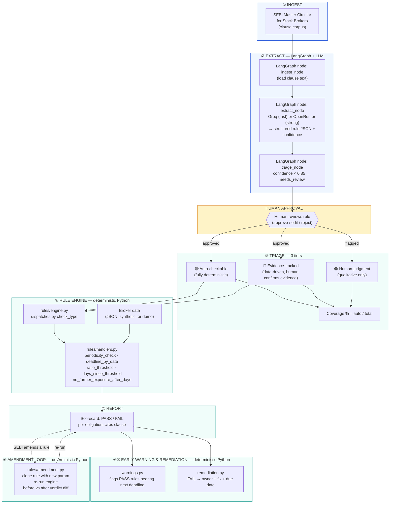

# RegCheck — Architecture

RegCheck turns SEBI's Master Circular for Stock Brokers into executable, auditable
compliance checks. This document explains the full pipeline, the three-tier triage
model, the amendment loop, and exactly which parts are LLM/LangGraph vs. deterministic
Python.

## The core design principle

**The LLM drafts. The engine decides.**

An LLM is excellent at reading unstructured regulatory prose and proposing a structured
interpretation — but it is non-deterministic and unauditable as a decision-maker. A
regulator or auditor needs the *same* answer every time, with a traceable reason. So
RegCheck draws a hard line:

- Stages 1–3 (ingest, extract, triage) may call an LLM. Output is always a **draft**
  that a human approves.
- Stages 4–8 (check, report, warn, remediate, amend) are **plain deterministic Python**.
  No LLM call happens anywhere near a PASS/FAIL decision.

## Pipeline diagram



**Legend:** blue boxes = LLM/LangGraph involved. Amber = human-in-the-loop. Teal = pure
deterministic Python, no LLM.

## Stage-by-stage

| # | Stage | Module(s) | LLM? | Output |
|---|-------|-----------|------|--------|
| 1 | Ingest | `pipeline/ingest.py` | No | Clause text + title loaded from the corpus |
| 2 | Extract | `pipeline/extract.py`, `llm/provider_router.py` | **Yes** (Groq fast / OpenRouter strong) | Structured rule JSON + confidence score |
| 3 | Triage | `pipeline/triage.py` | No (rules on the LLM's own confidence/tier output) | Tier assignment + `needs_review` gate at confidence < 0.85 |
| — | Human approval | `POST /api/rules/{id}/approve` | No | Rule flips to `approved` and becomes executable |
| 4 | Rule engine | `rules/engine.py`, `rules/handlers.py` | No | `CheckResult` (PASS/FAIL/NOT_APPLICABLE) with evidence + clause citation |
| 5 | Report | `GET /api/report` | No | Scorecard: every result, clickable to its clause |
| 6 | Early warning | `warnings.py` | No | Obligations that PASS today but breach within 21 days |
| 7 | Remediation | `remediation.py` | No | FAIL → owner, fix, due date |
| 8 | Amendment loop | `rules/amendment.py` | No | Before/after verdict diff when a rule parameter changes |

## LangGraph usage

LangGraph orchestrates **only stages 1–3** (`backend/app/pipeline/graph.py`):

```
ingest_node → extract_node → triage_node → END
```

This is intentionally the smallest possible graph — a linear chain with no branching —
because the interesting complexity in RegCheck is in the deterministic engine, not the
LLM orchestration. LangGraph gives us a clean, inspectable state object
(`PipelineState`) that's easy to extend (e.g. add a retry-on-low-confidence branch, or
a multi-clause batch node) without restructuring the rest of the system.

## Provider routing (Groq + OpenRouter)

`backend/app/llm/provider_router.py` exposes one function, `call_llm(prompt, tier)`:

- `tier="fast"` → **Groq** (cheap, low-latency — used for the extraction draft, since
  clause-by-clause extraction is an iterate-and-review workflow where speed matters
  more than the strongest possible reasoning).
- `tier="strong"` → **OpenRouter** (routes to a stronger model — used when a clause is
  ambiguous enough to warrant it).
- `LLM_PROVIDER_MODE=groq|openrouter` in `.env` overrides the tier logic and forces
  everything through one provider (useful if you only have one key).

Both providers speak the OpenAI-compatible chat-completions schema, so the router is a
single `httpx` call shape with the base URL/key/model swapped.

## The three triage tiers

1. **Auto-checkable** — the obligation reduces to a deterministic comparison against
   broker data (a date, a ratio, a periodicity). The engine runs it with zero human
   involvement per run (a human approved the rule once, at extraction time).
2. **Evidence-tracked** — the check itself is data-driven (e.g. "was the certificate
   filed within 60 days?"), but the *evidence* needs a human to confirm it's genuine
   (e.g. is this actually a valid CA-signed certificate, not a forged PDF?). RegCheck
   runs the deterministic date check and flags the result for human evidence
   confirmation.
3. **Human judgment** — no data check is possible. The obligation is qualitative (e.g.
   "is the grievance redressal mechanism adequate?"). RegCheck surfaces these
   obligations explicitly rather than pretending to automate them — this is what makes
   the coverage % honest.

**Coverage % = auto-checkable obligations ÷ total obligations.**

## The amendment loop

When SEBI tightens a rule (e.g. VAPT periodicity 6 months → 3 months), nothing needs to
go back through the LLM. `rules/amendment.py`:

1. Takes the existing, human-approved `Rule` object.
2. Clones it with the new parameter (`periodicity_days: 182 → 91`).
3. Re-runs `rules/engine.py` on the **same broker data**, twice (before/after).
4. Returns both verdicts and whether the verdict flipped.

This is why the periodicity-based rules in the seed data are deliberately tuned so the
VAPT check is a **narrow PASS** (167 days elapsed against a 182-day limit) — tightening
the limit to 91 days flips it straight to FAIL, which is the live demo of "regulatory
change → operational impact" in under a second, with full auditability (the same
clause citation and the same deterministic handler, just a different threshold).

## Storage

Everything is flat JSON under `backend/data/`, accessed through `storage/store.py` — a
thin repository interface. This keeps the demo dependency-free (no DB to provision) while
keeping a clean seam: swapping in SQLite is a change to `store.py` only, and the same
seam is where a Neo4j-backed obligation-supersession graph (rule v2 *supersedes* rule
v1, with a queryable history of amendments) would plug in for a production version —
none of the engine, pipeline, or API code would need to change.
