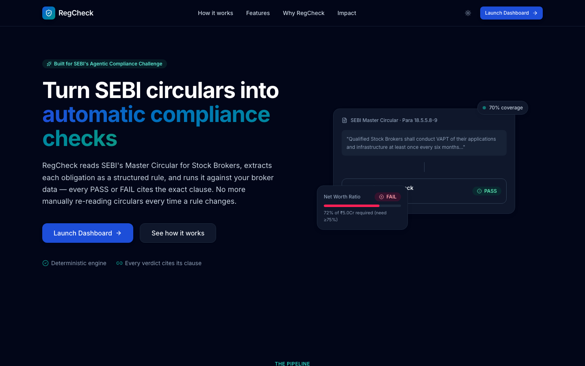
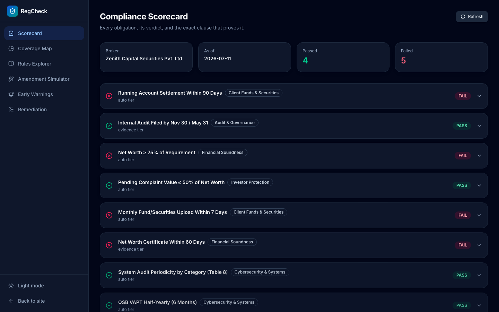
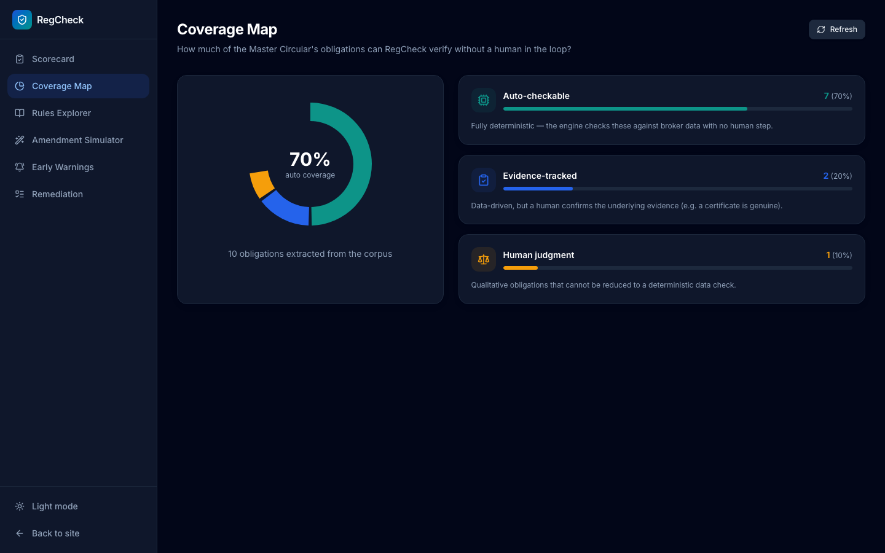
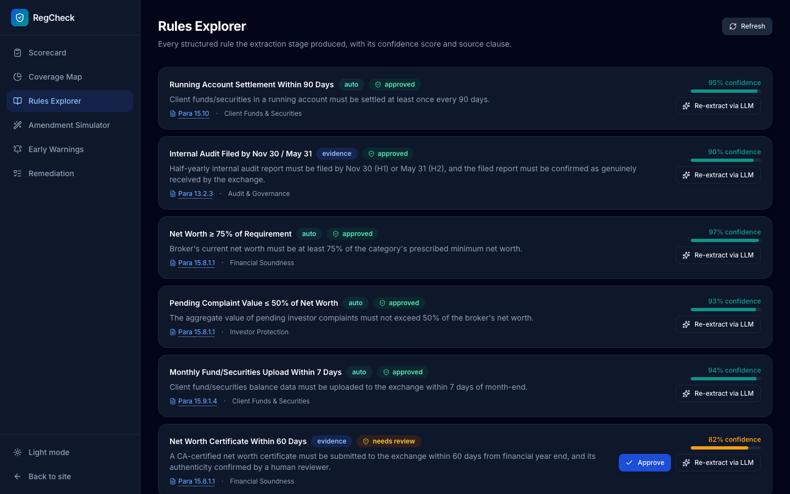
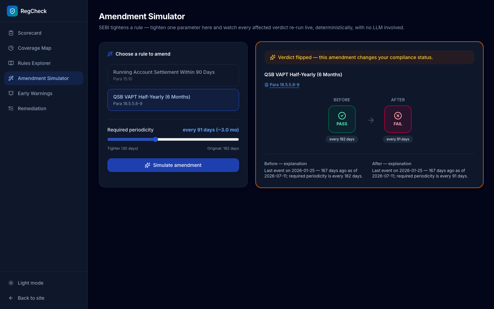
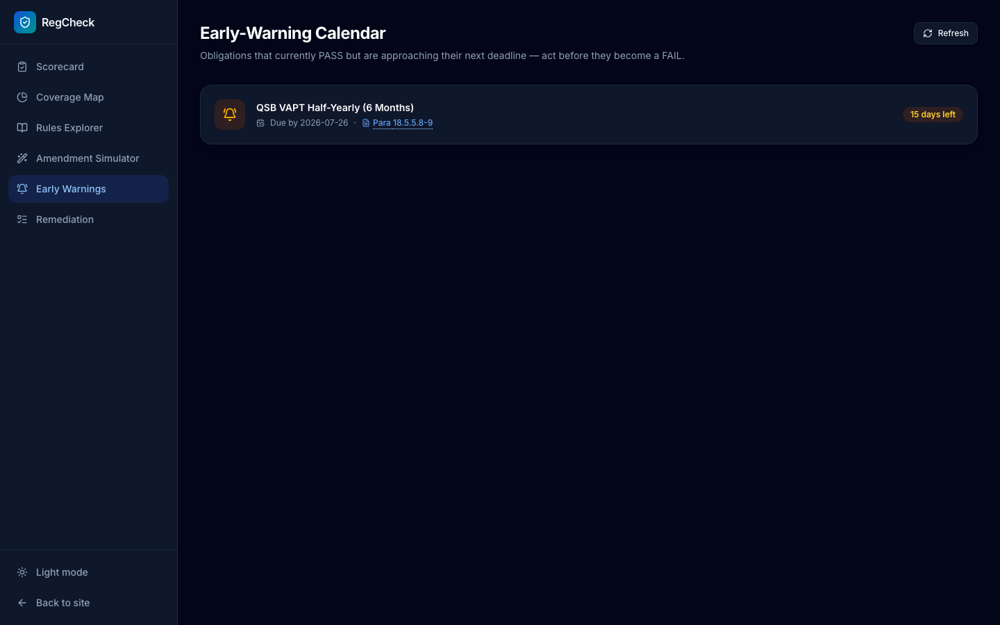
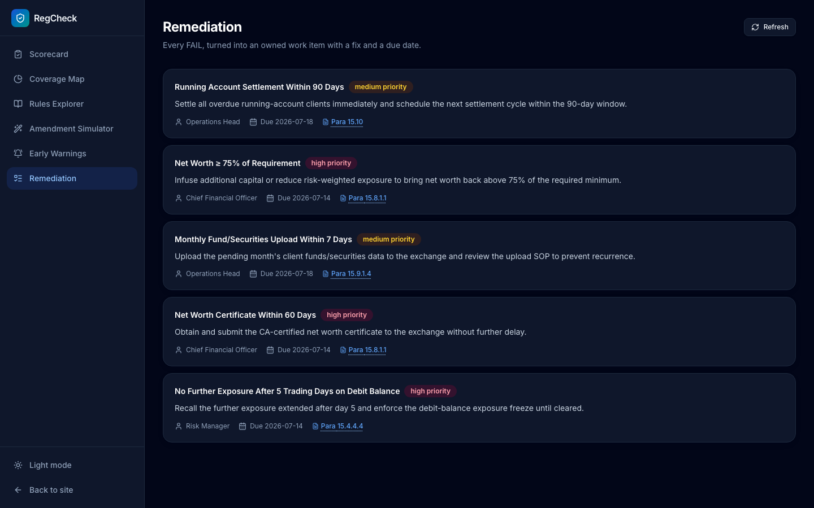

# RegCheck

**Turn SEBI circulars into automatic, auditable compliance checks.**

A hackathon submission for SEBI's *"Agentic Compliance — From Regulatory Text to
Operational Action"* problem statement.

- **Intermediary category:** Stock brokers
- **Regulatory corpus:** SEBI's Master Circular for Stock Brokers
- **Concrete scenario demonstrated:** 9 real obligations (running-account settlement,
  internal audit deadlines, net worth thresholds, complaint exposure, monthly upload
  deadlines, net-worth certificate filing, system audit periodicity, QSB VAPT
  periodicity, debit-balance exposure freeze) checked against a synthetic broker
  dataset, plus a live "amendment" demo showing a verdict flip when SEBI tightens a rule.



---

## Screenshots

<table>
<tr>
<td width="50%">

**Compliance Scorecard** — every obligation, PASS/FAIL, with the clause that proves it


</td>
<td width="50%">

**Coverage Map** — the honest 3-tier split (auto / evidence / judgment) + coverage %


</td>
</tr>
<tr>
<td width="50%">

**Rules Explorer** — confidence scores, citations, and the human-approval gate


</td>
<td width="50%">

**Amendment Simulator** — tighten a rule, watch the verdict flip live (the demo centerpiece)


</td>
</tr>
<tr>
<td width="50%">

**Early-Warning Calendar** — obligations approaching their next deadline


</td>
<td width="50%">

**Remediation** — every FAIL turned into an owned work item


</td>
</tr>
</table>

---

## The problem

SEBI issues circulars, master circulars, and amendments continuously. Each one creates
obligations for market intermediaries. Today, translating "SEBI just published this" into
"here's exactly what our systems need to check, and proof that we're compliant" is a
manual, error-prone process — especially painful for smaller brokers without a large
compliance team. Two failure modes recur:

1. **Dynamic regulatory translation is slow.** Someone has to read a PDF circular,
   figure out what it actually requires operationally, and communicate that to the teams
   who run the checks.
2. **Ongoing compliance management has no audit trail.** Even once a rule is understood,
   proving *"we checked, and here's the evidence"* every reporting cycle is manual,
   and re-checking after every amendment means starting over.

## What RegCheck does

RegCheck is a pipeline that turns each clause of the SEBI Master Circular for Stock
Brokers into a structured, machine-checkable rule; runs it deterministically against a
broker's data; and produces a scorecard where **every verdict cites the exact clause
that proves it.**

The core design principle — **the LLM drafts, a deterministic engine decides** — is
what makes the output auditable rather than just "an AI said so." See
[ARCHITECTURE.md](./ARCHITECTURE.md) for the full pipeline diagram and stage-by-stage
breakdown.

### The 8-stage pipeline

1. **Ingest** — pull SEBI circular clause text into a corpus.
2. **Extract** — an LLM reads a clause and drafts a structured rule (JSON) with a
   confidence score and the exact clause citation.
3. **Triage** — sort the obligation into one of three tiers (**auto-checkable**,
   **evidence-tracked**, **human-judgment**) and compute a coverage %. Anything under
   0.85 confidence is flagged `needs_review` — a human approves it once before it ever
   runs.
4. **Rule engine** — a deterministic Python engine runs every approved auto/evidence
   rule against broker data and returns PASS/FAIL with the source clause as proof.
5. **Report** — one scorecard, every line expandable to show the offending data and a
   "view clause" link.
6. **Early warning** — flags obligations that currently PASS but are close to their next
   deadline (e.g. "VAPT due again in 15 days").
7. **Remediation** — every FAIL becomes a work item: owner, fix, due date.
8. **Amendment loop** — tighten one rule parameter and every affected verdict re-runs
   instantly, deterministically, against the same broker data — no LLM call needed.

---

## Tech stack

| Layer | Choice |
|---|---|
| Frontend | React (Vite + TypeScript), Tailwind CSS v4, shadcn/ui-style components, lucide-react, framer-motion, recharts |
| Backend | FastAPI (Python), LangGraph for the extraction pipeline |
| LLM providers | Groq (fast tier — extraction drafts) + OpenRouter (strong tier), via a provider-router module |
| Storage | Flat JSON files (`backend/data/`) behind a repository interface — swappable for SQLite/Neo4j without touching the engine |
| Rule engine | Plain Python, JSON-logic-style handlers dispatched by `check_type` — **not** the LLM |

---

## Repository layout

```
RegCheck/
├── README.md                 ← you are here
├── ARCHITECTURE.md           ← pipeline diagram + design rationale
├── .env.example
├── backend/
│   ├── app/
│   │   ├── main.py           FastAPI app + CORS
│   │   ├── config.py         env/config loading
│   │   ├── llm/               provider_router.py, prompts.py
│   │   ├── pipeline/          LangGraph: ingest → extract → triage
│   │   ├── rules/              engine.py, handlers.py, amendment.py
│   │   ├── remediation.py, warnings.py
│   │   ├── storage/            models.py (Pydantic), store.py (JSON repo)
│   │   └── api/routes.py       all REST endpoints
│   └── data/
│       ├── circular_corpus.json   9 real clause texts, cited by para
│       ├── rules.seed.json        10 structured rules (9 real + 1 illustrative judgment-tier)
│       └── broker_profile.json    synthetic broker dataset
└── frontend/
    └── src/
        ├── pages/Landing.tsx, Dashboard.tsx
        ├── components/landing/*   hero, how-it-works, features, comparison, ROI, footer
        ├── components/dashboard/* scorecard, coverage map, rules explorer,
        │                          amendment simulator, early-warning calendar, remediation
        ├── components/ui/*        button, card, badge, tabs, dialog, tooltip, skeleton
        └── lib/api.ts             typed fetch client
```

---

## The data

### Rules (`backend/data/rules.seed.json`)

Nine real obligations from the Master Circular, each with its exact paragraph citation:

| Obligation | Para | Tier |
|---|---|---|
| Running-account settlement within 90 days | 15.10 | auto |
| Internal audit filed by Nov 30 / May 31 | 13.2.3 | evidence |
| Net worth ≥ 75% of requirement | 15.8.1.1 | auto |
| Pending complaint value ≤ 50% of net worth | 15.8.1.1 | auto |
| Monthly fund/securities upload within 7 days | 15.9.1.4 | auto |
| Net-worth certificate within 60 days | 15.8.1.1 | evidence |
| System audit periodicity by category (Table 8) | 16 | auto |
| QSB VAPT half-yearly | 18.5.5.8-9 | auto (amendable — demo rule) |
| No further exposure after 5 trading days on debit balance | 15.4.4.4 | auto |

A tenth, illustrative **judgment-tier** obligation ("adequacy of grievance redressal
mechanism") is included to demonstrate the third triage tier honestly — some
obligations genuinely cannot be reduced to a deterministic check, and RegCheck says so
rather than faking a rule for it.

### Broker data (`backend/data/broker_profile.json`)

**This is synthetic data**, generated for the demo. SEBI's public SCORES disclosures
are aggregate statistics, not per-broker operational records, so there is no public
dataset of "a broker's actual net worth / audit dates / complaint ledger" to pull from.
A real pilot would connect to:

- the broker's own back-office systems, or
- SEBI's **Innovation Sandbox**, using anonymized test data.

The synthetic broker ("Zenith Capital Securities Pvt. Ltd.") is deliberately seeded so
**4 rules PASS and 5 FAIL**, and so the VAPT rule is a **narrow PASS** (last VAPT 167
days ago against a 182-day limit) — tightening that limit to 91 days (3 months) flips
it to FAIL live in the Amendment Simulator.

---

## Setup

### 1. Clone and configure environment variables

```bash
cp .env.example backend/.env
```

Edit `backend/.env` and add your keys:

```env
GROQ_API_KEY=...        # free — https://console.groq.com/keys
OPENROUTER_API_KEY=...  # free — https://openrouter.ai/keys
```

Both providers are configured to use **free-tier models by default** — `GROQ_MODEL`
defaults to `llama-3.1-8b-instant` (Groq's API has no paid requirement), and
`OPENROUTER_MODEL` defaults to `meta-llama/llama-3.3-70b-instruct:free` (the `:free`
suffix routes to OpenRouter's zero-cost model pool). No payment method is needed for
either key.

> **Note:** OpenRouter's free model pool is rate-limited (a small number of requests
> per day per key unless you add credit). If the "strong" tier hits a `429`, the API
> surfaces a clear error rather than failing silently — retry after a short wait, or
> point `OPENROUTER_MODEL` at a different `:free` model.

Both keys are optional for the *dashboard* demo — the scorecard, coverage map,
warnings, remediation, and amendment simulator all run entirely off the pre-approved
seed rules and the deterministic engine, with **no LLM calls**. Keys are only needed to
exercise the **"Re-extract via LLM"** button in the Rules Explorer, which re-runs the
live ingest → extract → triage pipeline. Without a key, that action fails with a clear
error message — it does not silently fall back to fake data.

### 2. Backend

```bash
cd backend
python3 -m venv .venv && source .venv/bin/activate
pip install -r requirements.txt
uvicorn app.main:app --reload --port 8000
```

API docs at `http://127.0.0.1:8000/docs`.

> **Note on Python version:** the pinned `pydantic` version needs Python ≤ 3.13 (native
> wheels aren't published for 3.14 yet as of this writing). If `python3 --version`
> reports 3.14, install 3.12/3.13 (e.g. `brew install python@3.12`) and create the venv
> with that interpreter instead.

### 3. Frontend

```bash
cd frontend
npm install
npm run dev
```

Dashboard at `http://localhost:5173`. It talks to the backend via `VITE_API_URL`
(defaults to `http://127.0.0.1:8000`, set in `frontend/.env.local`).

---

## API endpoints

| Method | Path | Purpose |
|---|---|---|
| `GET` | `/api/clauses` | The full circular corpus |
| `GET` | `/api/rules` | All structured rules |
| `POST` | `/api/rules/{id}/approve` | Approve/flag a rule |
| `POST` | `/api/extract` | Run ingest → extract → triage on a clause (LLM) |
| `POST` `/GET` | `/api/checks/run`, `/api/report` | Run all rules → scorecard |
| `GET` | `/api/coverage` | 3-tier breakdown + coverage % |
| `GET` | `/api/warnings` | Obligations nearing their next deadline |
| `GET` | `/api/remediation` | FAILs turned into work items |
| `POST` | `/api/amendment/simulate` | Before/after verdict diff for a tightened rule |
| `GET` | `/api/broker` | The synthetic broker profile |

---

## Demo script

1. **Landing page** (`/`) — the pitch: pipeline flow, features, "chatbot vs RegCheck"
   comparison, ROI stats.
2. **Scorecard** (`/dashboard`) — 9 obligations, 4 PASS / 5 FAIL. Expand a row (e.g.
   "Net Worth ≥ 75%") to see the computed evidence (72% vs 75% required) and click
   **"Para 15.8.1.1"** to see the exact source clause text in a dialog.
3. **Coverage Map** — 70% of obligations are fully auto-checkable; the donut breaks down
   auto / evidence / judgment tiers honestly.
4. **Rules Explorer** — every rule's confidence score and citation. Point out the
   evidence-tier rule sitting at 0.82 confidence (`needs_review`) — this is the
   human-approval gate in action.
5. **Amendment Simulator** (the centerpiece) — select "QSB VAPT Half-Yearly," drag the
   periodicity slider from 182 days down toward 91 days, click **Simulate amendment**.
   Watch PASS flip to FAIL live, with the same clause citation and a before/after
   explanation — this is a SEBI amendment being operationalized in under a second.

   

6. **Early-Warning Calendar** — the VAPT check is currently a PASS with only 15 days of
   headroom before its next deadline; this is exactly what a compliance officer would
   want flagged before it becomes a FAIL.
7. **Remediation** — the 5 FAILs, each with an owner, a concrete fix, and a due date.

---

## Design notes / what's simplified for the hackathon

- **Storage is flat JSON**, not a database — sufficient for a fixed demo corpus, with a
  clean repository interface (`storage/store.py`) so swapping in SQLite or adding a
  Neo4j-backed obligation-supersession graph later doesn't touch the engine or API.
- **The circular corpus is a curated excerpt**, not a full PDF parse — `pipeline/ingest.py`
  is the single seam where a real PDF-fetch-and-chunk step would slot in.
- **Broker data is synthetic**, for the reasons explained above (SEBI's SCORES data is
  aggregate-only). The schema is realistic and the seam to a real back-office/Sandbox
  feed is `storage/store.py::get_broker_profile()`.
